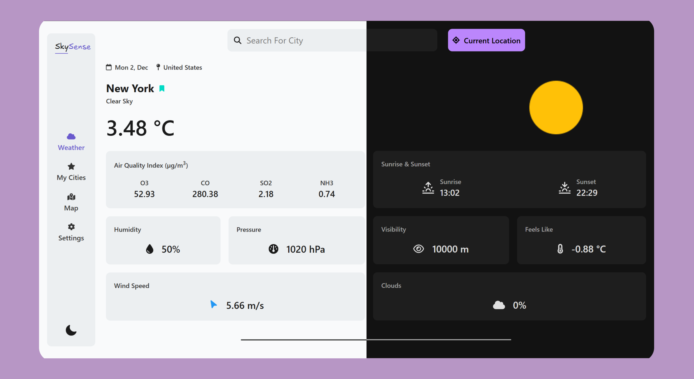
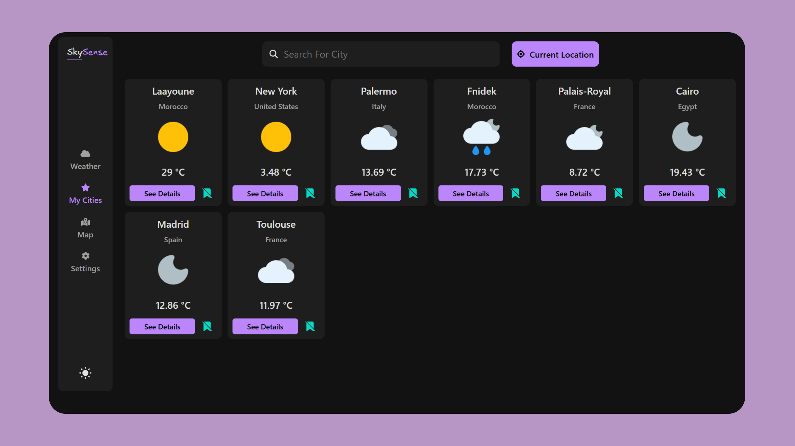
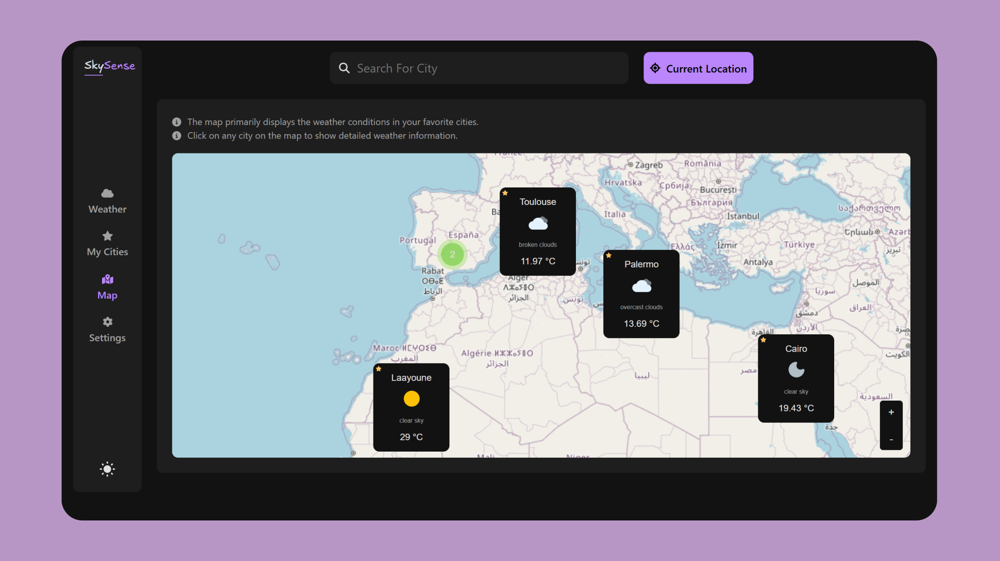
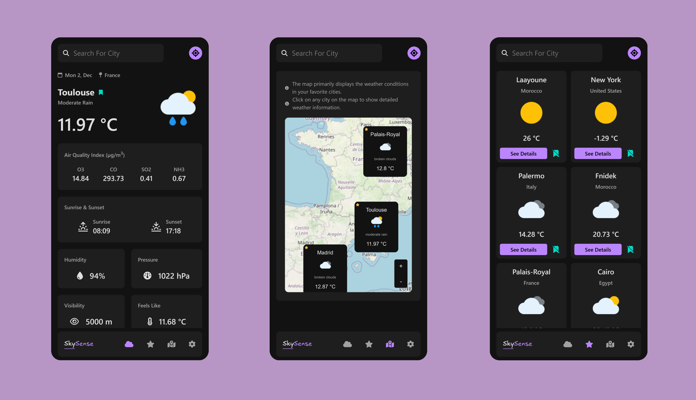

# SkySense


**SkySense** is a web application for finding out the weather conditions all over the world.

## 🌐 Live Demo

Check out the live version here: [Live Demo Link](https://openskysense.netlify.app/)

## ✨ Features

- 📱 **Responsive Design**: Adaptable to all screen sizes for seamless user experience.
- 🌗 **Dark and Light Mode Support**: Easily switch between dark and light themes.
- 🌐 **Bilingual Support**: Fully supports Arabic and English languages.
- ☁️ **Global Weather Search**: Get weather updates for any city worldwide.
- 📆 **5-Day Weather Forecasts**: View detailed forecasts for the next five days for a specific city.
- 📌 **City Favorites**: Save cities for quick access to their weather updates without searching each time.
- 🗺️ **Interactive Map**: Displays your favorite cities on an interactive map with their weather information.
- 👆 **On-Map Weather Updates**: Click any location on the map to view its current weather.
- 📍 **Current Location Weather**: Quickly access weather updates for your current location.
- 🔄 **Unit Customization**: Toggle between units for temperature, wind speed, pressure, and more.

## 🛠️ Tech Stak

<div style="display: flex; flex-wrap: wrap; gap: 10px;">


</div>

## 📸 Screenshots






## ⚙️ Run Locally

### How to Run the Project Locally

1. **Clone the Repository**

   ```bash
   git clone https://github.com/id-abdellah/SkySense.git
   ```

2. **Navigate to the Project Directory**

   ```bash
   cd SkySense
   ```

3. **Install Dependencies**

   ```bash
   npm install
   ```

4. **Obtain an API Key from OpenWeatherMap**

   - Go to [OpenWeatherMap](https://openweathermap.org/), create an account, and generate your API key.

5. **Create a `.env` File**

   - In the project root directory, create a file named `.env`.

6. **Add Your API Key to the `.env` File**

   - Open the `.env` file and add the following line:
     ```env
     VITE_API_KEY=your_api_key
     ```
   - Replace `your_api_key` with the actual API key you obtained from OpenWeatherMap.

7. **Start the Development Server**

   ```bash
   npm run dev
   ```

8. **Access the Project in Your Browser**

## 📄 License

This project is licensed under the [MIT LICENSE](https://choosealicense.com/licenses/mit/)
